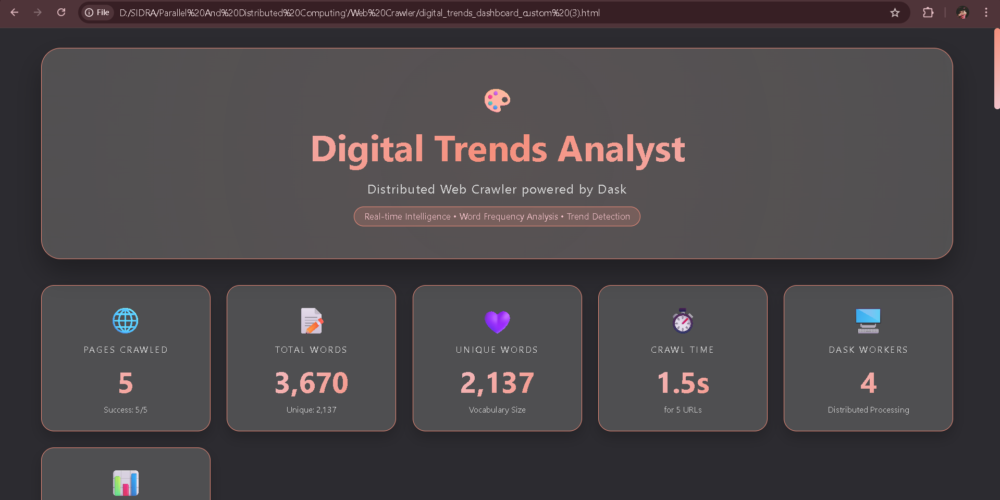
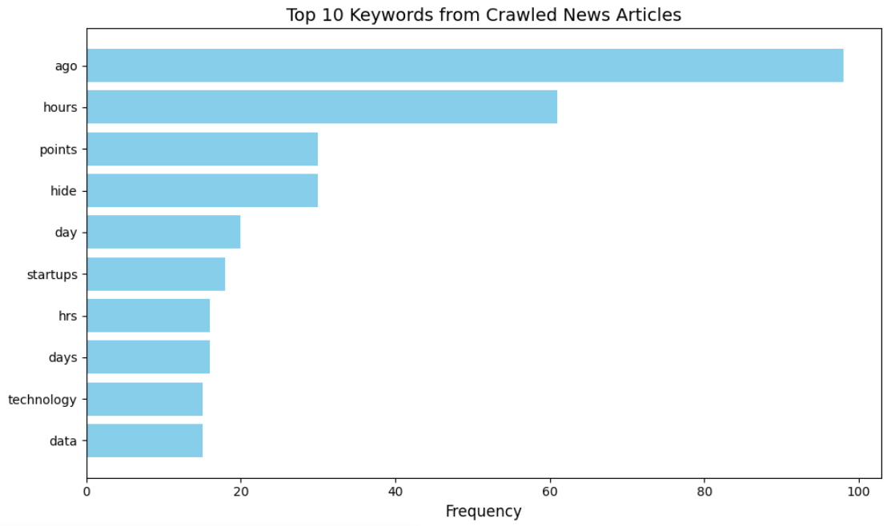
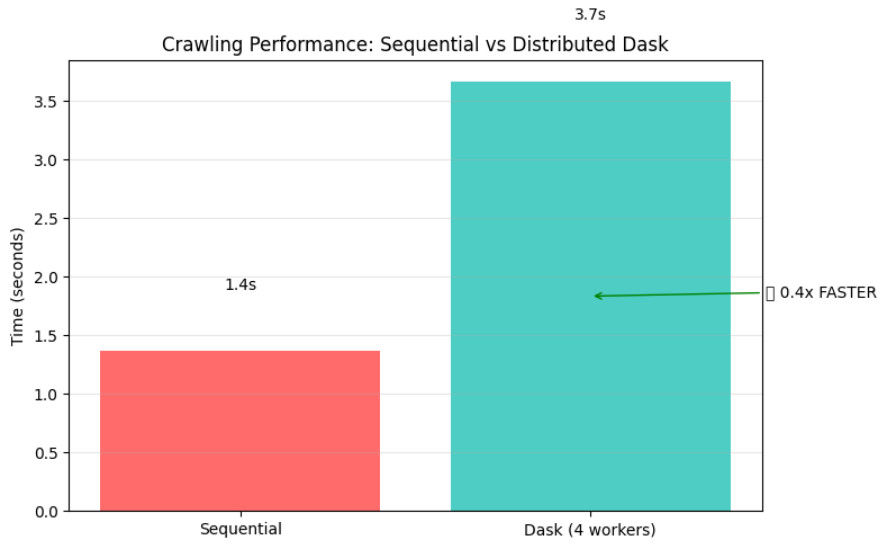
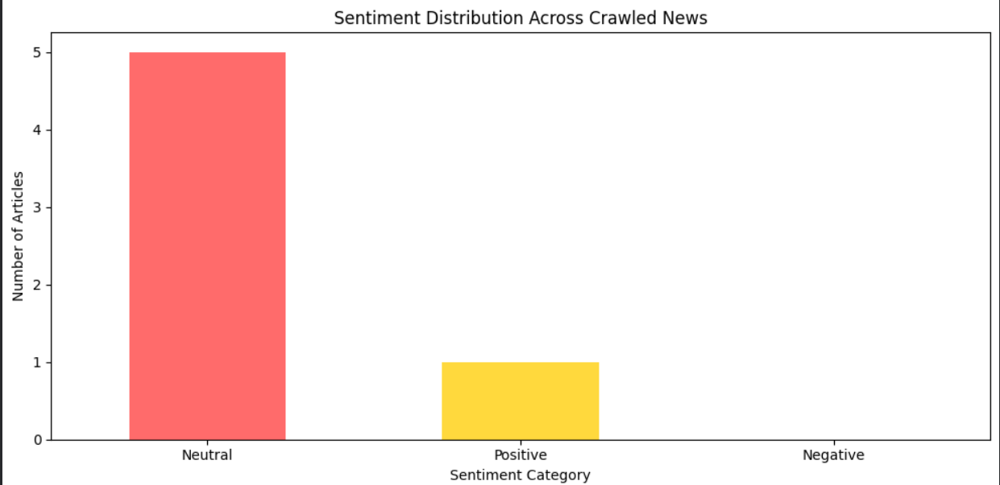
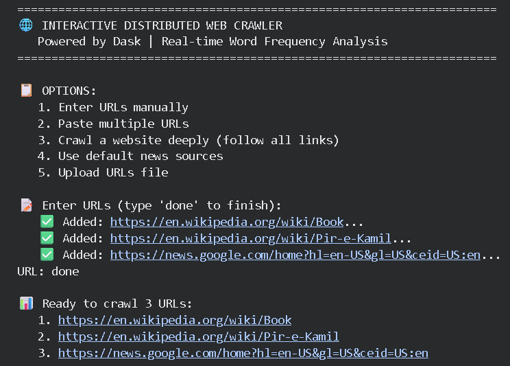
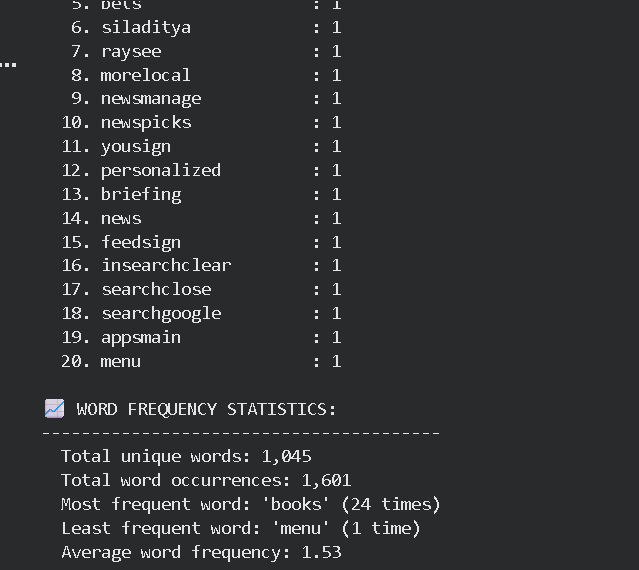
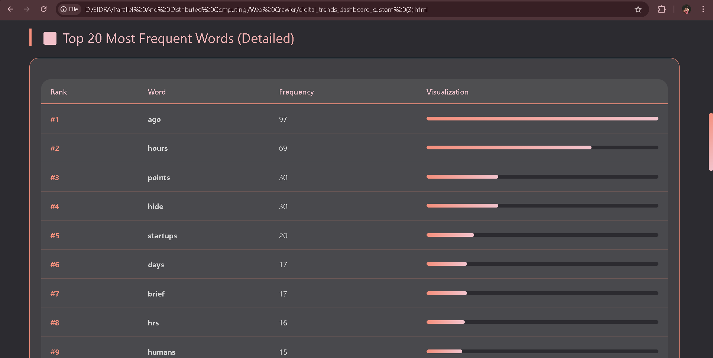
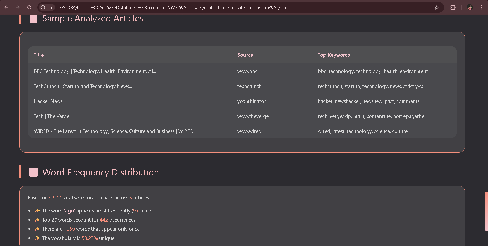

# 🕷️ Distributed Web Crawler using Dask

A high-performance **distributed web crawler** that fetches web pages in parallel using **Dask**, performs **text analysis**, **sentiment detection**, **trend identification**, and generates **interactive dashboards**. Built with **Python, Dask, and BeautifulSoup**, it combines **speed, efficiency, and real-time analytics** in one platform. 🚀📊

---

## Features

- 🔄 **Distributed crawling** using Dask with 4 parallel workers
- 📊 **Word frequency analysis** – Top 15, Top 20, and Last 20 words
- 💖 **Sentiment analysis** – Positive/Neutral/Negative detection using TextBlob
- 📈 **Trend detection** – Keyword velocity calculation (% increase)
- 🏆 **Source authority ranking** – Trust scores for each website
- 🎨 **Interactive HTML dashboard** – Custom dark theme with export to PDF
- 📁 **Multiple input options** – 5 ways to provide URLs
- 💾 **Persistent storage** – All data saved to Google Drive

---

## Tech Stack

| Category | Technology |
|----------|------------|
| **Language** | Python 3.12 |
| **Distributed Computing** | Dask (4 workers) |
| **Web Scraping** | Requests, BeautifulSoup4 |
| **Data Analysis** | Pandas, Collections.Counter |
| **Text Processing** | NLTK (stopwords), Regex |
| **Sentiment Analysis** | TextBlob |
| **Visualization** | Matplotlib, Seaborn |
| **Environment** | Google Colab |
| **Storage** | Google Drive |

---

## Screenshots
 
 **Dashboard Main View**
 
   

**Top Keywords Analysis**

 

**Performance Comparison**

**Sentiment Distribution**

**Distributed Crawl Output**

**Word Frequency Results**

 

**Dashboard Statistics**

 

---

## How to Run

Follow these steps to run the project:

### Google Colab 

1. **Open Google Colab**  
   [https://colab.research.google.com/](https://colab.research.google.com/)

2. **Upload the notebook**  
   - File → Upload Notebook → Select `Web_Crawler_FINAL.ipynb`

3. **Run all cells**  
   - Runtime → Run all

4. **Choose URL input option**  
   - `1` – Enter URLs manually
   - `2` – Paste multiple URLs
   - `3` – Deep crawl a website
   - `4` – Use default news sources
   - `5` – Upload URLs file

5. **View results**  
   - Check output in Colab
   - Open generated HTML dashboard

